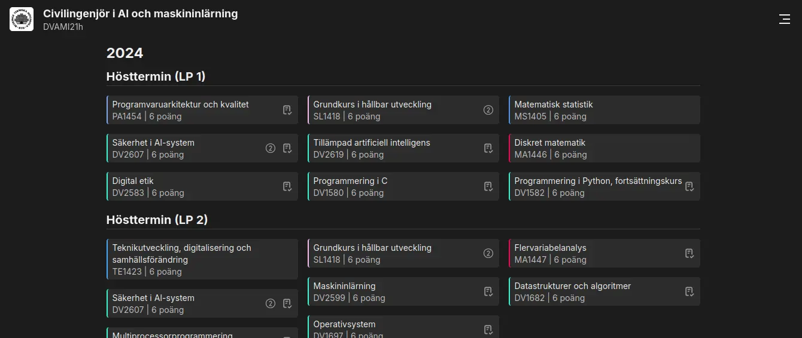

# BTH Programs


A web-application to get an overview of their program at Blekinge Institute of Technology. The app allows a users to see a timeline of their courses as well as compare between other programs.

## Requirements

```txt
Python >= 3.10
NodeJS >= 16
```

## Installing

```bash
git clone https://github.com/marcusfrdk/bth-programs
cd bth-programs
pip install -r requirements.txt 
cd app
npm install
```

## Generating Data

Start by generating the required data:

```bash
python3 generate.py
```

*Note: The library Pyppeteer might throw NetworkErrors. This is okay, the function retries the download.*

## Development

To get the development environment set up, run the following commands:

```bash
cd app
npm run dev
```

## Deployment

The deployment process is done automatically when pushing to the `main` branch through [Vercel](https://vercel.com).
